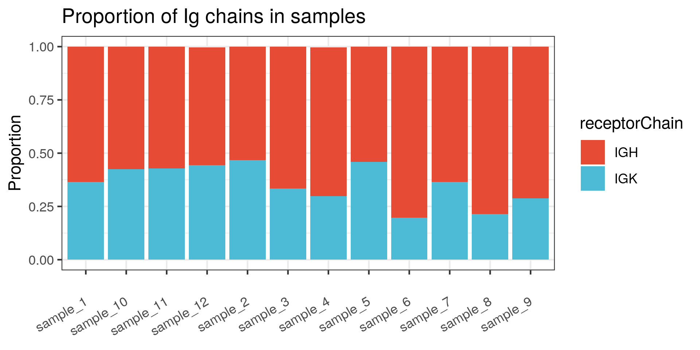
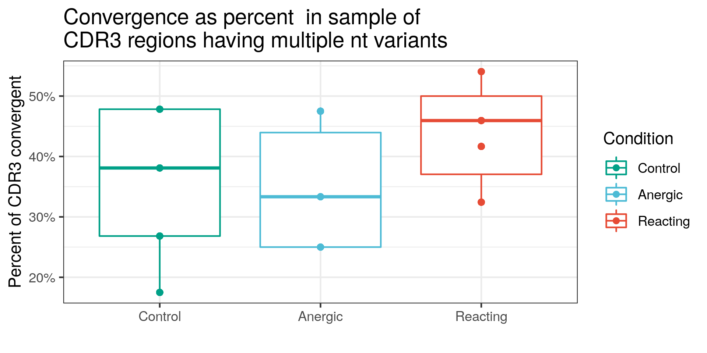

# repertoireseq_container

A docker container with tools to help analyze Immune Repertoire from (currently bulk) RNAseq.

## Tools integrated

Currently MiXCR (https://github.com/milaboratory/mixcr), Immunarch (https://immunarch.com/) and some components of the Imcantation framework (https://immcantation.readthedocs.io/) are added.
Development is now in progress.

## Usage

This is a container designed to be used as part of a Nextflow pipeline. 
Additionally, nextflow can also be run inside the contatiner, although this is recommended for testing purposes only.  

If the measured data is in the `input_data` folder of the current directory (alternatively, using test data in `test_datas/imulated_input`), a basic report can be generated issuing the following command:

```
docker run -it -v $PWD:/home/rstudio/local_files \
  szabogtamas/repertoireseq \
  nextflow run /home/rstudio/repo_files/nextflow/main.nf \
  --input_folder /home/rstudio/local_files/input_data \
  --clonotype_dir /home/rstudio/local_files/report/reconstruction_logs \
  --table_path /home/rstudio/local_files/report/repertoire_summary.xlsx \
  --figure_path /home/rstudio/local_files/report/figures \
  --report_folder /home/rstudio/local_files/report \
  --report_filename "my_test_repertoire_report.html" \
  --report_title "A test report" \
  --report_author "Label" \
  --condition_order "Control,Reacting,Anergic" \
  --report_author "Me"
```

In addition to the generated interactive html report, some major figures will also be exported in pdf format, to the  `figures` folder. Assembly reports and a raw repertoire table will also be generated.

## Output exapmles

The range of figures generated by the notebook template, includes some very basic decriptive stats, like clonotype abundance:



As welll as some more complex representations, like convergence of clones.



## Test data source

A simulated dataset, derived from Ig sequences published by [Goldstein et al.](https://pubmed.ncbi.nlm.nih.gov/31428692/) is available in test_data/simulated_input folder.